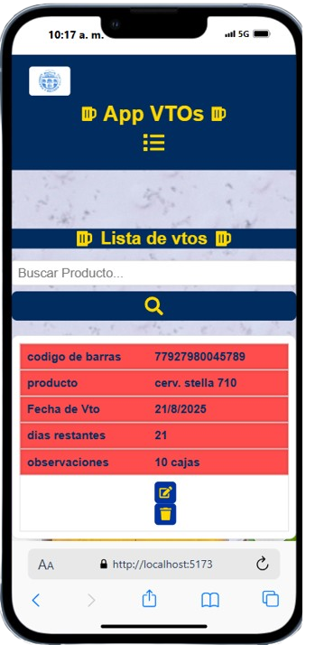
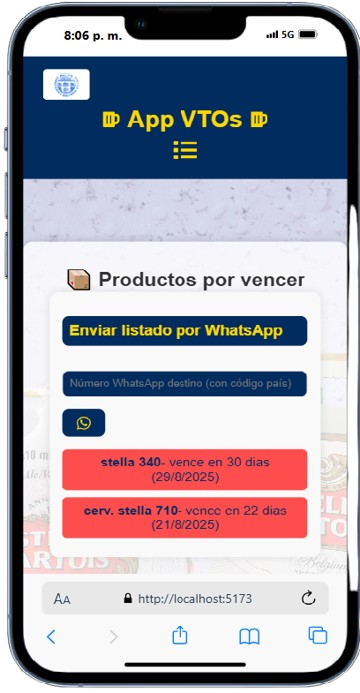

# VTOS_APP

Aplicación desarrollada para gestionar productos, fechas de vencimiento, y enviar notificaciones por WhatsApp de forma sencilla y efectiva.

## 🎯 Propósito del proyecto

VTOS_APP nació como una solución práctica para llevar el control de productos con fecha de vencimiento, especialmente útil en entornos como almacenes, comercios o depósitos.

El objetivo principal es **evitar pérdidas económicas por vencimientos** mediante un sistema simple, visual y accesible desde cualquier dispositivo. Además, la opción de enviar notificaciones por WhatsApp lo convierte en una herramienta útil y adaptable a distintos usuarios.

Este proyecto también fue una excelente oportunidad para aplicar tecnologías modernas de frontend y backend sin servidores tradicionales.

## 🚀 Tecnologías utilizadas

### Frontend:

- React
- Vite
- CSS Modules
- SweetAlert2
- LocalStorage para almacenamiento temporal
- Librerías de íconos (FontAwesome, etc.)

### Backend:

- Google Sheets como base de datos
- Apps Script (para exponer la base como API REST)

### Extras:

- Escáner de código de barras (experimental, requiere acceso a cámara en dispositivos móviles)
- Envío de mensajes vía WhatsApp Web

## 🧑‍💻 Roles de usuario

- **Administrador:** Puede ver todos los vencimientos, agregar, editar y eliminar.
- **Usuario:** Solo ve y gestiona los vencimientos que cargó personalmente.

## ⚙️ Funcionalidades

- Escaneo de productos con código de barras (mobile)
- Filtrado por fecha de vencimiento
- Colores según urgencia (verde, amarillo, rojo)
- Ordenamiento automático
- Envío de resumen por WhatsApp
- Soporte multiusuario con perfiles diferenciados

## 📦 Cómo correr el proyecto

1. Clonar el repositorio:
   ```bash
   git clone https://github.com/MaritoSebastian/Vtos_app.git
   ```
2. Instalar dependencias y correr el servidor:
   ```bash
   cd Vtos_app
   npm install
   npm run dev
   ```
## 📱 Vistas en dispositivos móviles

<table>
<tr>
<td>   </td>
<td></td>
<td></td>
</tr> 
<tr>
<td>   </td>
<td></td>
<td></td>

</tr>
</table>
